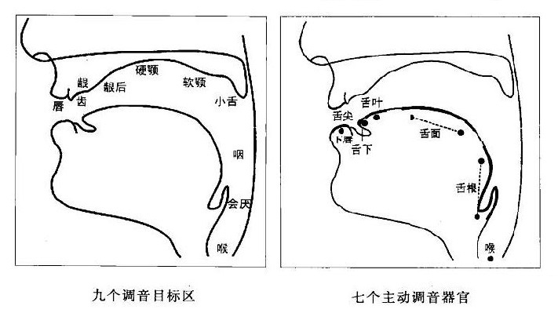
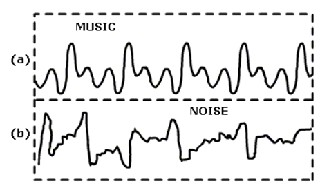

# 辅音？元音？

\
`本页面为测试版，内容随时改动`

## 在讨论发音之前，我们是怎么发音的？

- 在说明辅音元音的概念前，要先讲一讲发音部位。请注意，「发音」和「发声」看起来很相似，但它们是两个不同领域的词。「发声」是声乐领域会用到的词；「**发音**」才是语音学的词。或许你曾见过那个发音部位的图示，比如这个↓

  
   <em>调音部位图</em>

- 说句无关紧要的话，上面这张发音部位图，跟神经系统图、消化系统图并列为笔者小时候最不敢看的三张图。但这张图很有用，我们能通过这张图来摸清一个音的发音部位到底在哪里，而不用掰开自己的嘴一边口水横流一边照镜子来摸索。如果是严格的“发音部位图”，那么应该还要包括声带和肺部，因为肺部为发音提供**动力**，声带为发音提供**音源**。不过我们通常只关注那些负责调整**音色**的调音部位——说白了就是“嘴”，所以这张图严谨叫做「**调音部位图**」。

- 调音部位分为两大类：**主动调音部位**和**被动调音部位**。被动调音部位是跟头部其他部分固定在一起、运动不了的部位；主动调音部位是肌肉或通过关节与头部相连的、可以自主运动的部位。

  - 被动调音部位：上唇、齿、龈、硬腭、软腭、小舌、咽、会厌等
  - 主动调音部位：下唇、舌冠（舌尖、舌叶）、舌面、舌根、声门等

  简单来说，**下颌连带着口腔之下的肌肉都是主动的，而上颌连带着口腔上方的软组织都是被动的。**

## 怎么突然出现了这么多部位名词？这要怎么记？

- 首先，这些调音部位不太需要记，因为其中有些部位一般不用作描述一个音。我们实际常用的、有必要记的名词，是在下一小节出现的那些词汇。

- 如果要记的话，可以按位置从前到后记。最前面肯定是上下唇，上下唇包着的是上下齿，有齿那就有紧挨着齿的龈（基本只会用到上龈啦，下龈很难参与调音所以不考虑），龈往后是上牙膛也就是硬腭，硬腭再往后是软腭，软腭再往里悬垂着的是小舌，舌头能碰到的最深处、口鼻腔交汇处是咽，而会厌则在咽更靠下的地方。

## 什么是辅音，什么是元音？

- 辅音，又称子音，是指气流在口腔或咽头受到阻碍而形成的音。

- 元音，又称母音，是指气流通过口腔而不受阻碍发出的音。

- 从这两个名称[^1]上不难看出，人们认为元音更为原初，婴儿牙牙学语时先学会的就是元音（甚至不用学就会），而且在语音中有一种主导的色彩；而与之相对应地，辅音是有辅助性质的音。

- 发辅音时，上面提到的调音部位总会有至少一处在阻碍着气流呼出；而发元音时，调音部位全部让道，使气流能从肺部不受阻碍地顺畅呼出。这里的“阻碍”包括阻塞、震动或摩擦气流等。那么这种“阻碍”到底会影响什么呢？如果把辅音元音分别录音，然后放大观察它们的波形，会发现元音是比较规则的波，能明显看出其周期，这一点跟“乐音”很像；而许多辅音不规则，无法看出周期，这一点跟“噪音”很像。很显而易见对吧？毕竟开嗓子都用“啊”“喔”，而模拟噪波都用“嘶”“滋”。

  
   <em>波形图：a) 乐音；b) 噪音</em>

- 元音比辅音更洪亮清晰易于延长，更适合作为音节的核心，即「**音节核**」。当我们拉长声音大呼时，拉长的总是音节核，就像我们会说“西——撒——”而不是“xxxx西ssss撒”；会说“Noooo!”而不是“Nnnno!”

## 如果辅音和元音是对立的，那半元音又是什么？

- 那些听起来像元音但用起来像辅音的音，叫做半元音，实在要归类的话，它们**属于辅音**。最典型的就是英语`yes`中的`y`，音标写作`/j/`。普通话中也有，我们在背声母表的时候都背到过，`y`和`w`就是两个声母，即使它们听起来基本就是短`i`和短`u`。硬要说的话，这些半元音比它们对应的元音多了一些气流的摩擦（“阻碍”的一种）。

- 普通话中，把「衣」念成`/ji/`或者`/i/`都是可以的，即便是同一个人，他的「衣」也可能一会儿是`/ji/`，一会儿是`/i/`——大家分不清也听不出来。

- 辅音和元音虽然是对立的，但并没有一个明确的分界线。我们没法判断一个`/i/`加到多少摩擦就不再是`/i/`而变成了`/j/`。实际上，还有一类音，它们与半元音正好相反，听起来像辅音但用起来像元音。比如`/l/`、`/r/`，它们虽然是辅音，但也较为洪亮，而且能延长发音，所以也可以作为音节核。印度半岛的许多语言就把表示`/l/`和`/r/`的字母看作元音字母。

- 因此，现在也有学说主张“辅音元音”的分类并不科学，但就现阶段来看尚未有新兴的音素分类方式能成为主流。

- 接下来我们就来系统地看一看辅音元音到底都有哪些，请点击“下一小节”……

[上一小节](starting-from-english.md) | [返回目录](../README.md) | [下一小节](ipa.md)

[^1]: 台湾、日本等地将「子音」「母音」的说法作为规范。
