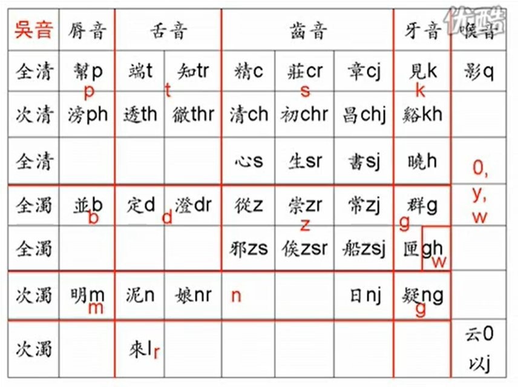
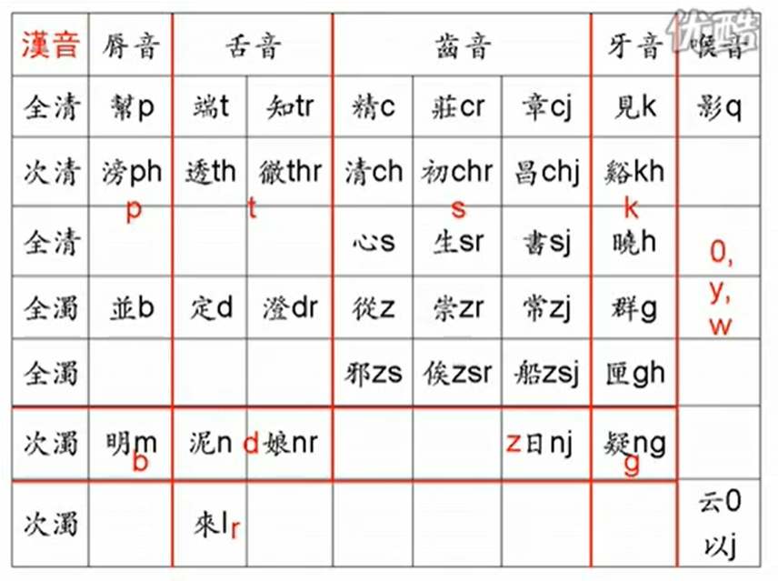

# 通过普通话能确定的音读

> 注意：本页面正在施工，内容尚未完善。

- 虽然音读听起来与普通话相差甚远，但它们终究都是中古汉语这一个老祖宗分化来的，所以肯定存在一些共通点。下面列举的是通过普通话就可以基本确定的音读，希望对你记忆音读词能有所帮助。

- 首先需要明确一点：**下述所有规则都必然有个别例外，但出于叙述方便，笔者仍会使用「所有」「一定」等字眼**。

## 声母的对应

- 关于声母总体的对应关系，我们先放两张表格。

  
   <em>吴音对应中古三十八声母</em>

  
   <em>汉音对应中古三十八声母
     <a href="https://www.bilibili.com/video/BV1ks411a7hh">（图源 polyhedron 中古汉语语音教程）</a>
  </em>

- 如果你已经通过中古汉语那一章了解了中古汉语语音的相关知识，那么这两张表可谓再清晰不过了。当然，不管你读没读过，我都要解释一下这两张表的。

- 由于中古汉语的声母繁多，而日语的辅音又很少，所以无论吴音汉音，都是在把许多相似的声母挤到一起，让一个辅音肩负起这沉重的使命。

  - 吴音中，全清次清归为清音、全浊归为浊音。明母还是`m`，泥娘日都归`n`，唯独疑母虽然是鼻音，但没有用鼻音拟，而是读了`g`。

  - 汉音中，无论全清、次清还是全浊，通通归为清音。而浊音分配给了次浊：明母的大部分成了`b`，泥母娘母成了`d`，而日母成了`z`（也就是`j`），疑母与吴音同，也是`g`。

## 韵母的对应

- 韵母是`a`、`ia`、`ua`、`uo`、`e`的字，如果不是入声字的话，常用音读一般都是`a`。
  > 二等字的吴音是`-e`，一三等字的吴音是`-a`。不过这些字更常用的多是汉音。

  |汉字|日语吴音|日语汉音|吴音罗马字|汉音罗马字|
  |---|---|---|---|---|
  |華|け|**か**|ke|k**a**|
  |夏|げ|**か**|ge|k**a**|
  |多|た|**た**|ta|t**a**|
  |者|しゃ|**しゃ**|sya|sy**a**|

- 韵母是`ao`的字吴音和汉音都是`-ou`（历史假名遣为「あう」或「えう」，今统演变为「おう」）。

  |汉字|日语吴音|日语汉音|吴音罗马字|汉音罗马字|
  |---|---|---|---|---|
  |小|し**ょう**|し**ょう**|sy**ou**|sy**ou**|
  |鳥|ち**ょう**|ち**ょう**|ty**ou**(chy**ou**)|ty**ou**(chy**ou**)|
  |老|**ろう**|**ろう**|r**ou**|r**ou**|
  |猫|み**ょう**|び**ょう**|my**ou**|by**ou**|

- 韵母是`ou`的字吴音是`-u`，汉音是长音`-ou`或`-uu`。

  |汉字|日语吴音|日语汉音|吴音罗马字|汉音罗马字|
  |---|---|---|---|---|
  |手|しゅ|しゅう|sy**u**|sy**uu**|
  |口|く|こう|k**u**|k**ou**|
  |遊|ゆ|ゆう|y**u**|y**uu**|
  |走|す|そう|s**u**|s**ou**|

- 韵母是`u`的字，如果不是入声字的话，吴音多数是`-u`少数是`-o`，汉音是`-o`。

  |汉字|日语吴音|日语汉音|吴音罗马字|汉音罗马字|
  |---|---|---|---|---|
  |図（圖）|づ|と|d**u**(z**u**)|t**o**|
  |書|しょ|しょ|sy**o**|sy**o**|
  |古|く|こ|k**u**|k**o**|
  |路|る|ろ|r**u**|r**o**|

## 前鼻音 ⇒ 拨音（はつおん）

- 尽管日语的鼻音并不时时刻刻都读作前鼻音，但普通话中所有前鼻音的韵母（即`an`、`en`、`in`、`ün`）在日语里的音读都是鼻音尾（即`ん`），无论吴音汉音。

  |汉字|日语吴音|日语汉音|吴音罗马字|汉音罗马字|
  |---|---|---|---|---|
  |安|あ**ん**|あ**ん**|a**n**|a**n**|
  |心|し**ん**|し**ん**|si**n**|si**n**|
  |原|ご**ん**|げ**ん**|go**n**|ge**n**|
  |神|じ**ん**|し**ん**|zi**n**|si**n**|

## 后鼻音 ⇒ 长音（ちょうおん）

- 既然拨音全都给了汉语的前鼻音，那么汉语的后鼻音怎么表示呢？按当时的读音，似乎长音更适合拟合汉语的后鼻音。

  |汉字|日语吴音|日语汉音|吴音罗马字|汉音罗马字|
  |---|---|---|---|---|
  |燈|と**う**|と**う**|to**u**|to**u**|
  |光|こ**う**|こ**う**|ko**u**|ko**u**|
  |蟲|ぢゅ**う**|ちゅ**う**|dyu**u**(jyu**u**)|tyu**u**(chyu**u**)|
  |鳴|みょ**う**|め**い**|myo**u**|me**i**|

- 但这里有一个普遍的例外：普通话里许多`-ong`或`-eng`的字在日语吴音里读对应的短音。这些字就需要额外记忆了。
  > 这些字均属于曾摄或通摄，而梗摄的字未见短音。

  |汉字|日语吴音|日语汉音|吴音罗马字|汉音罗马字|
  |---|---|---|---|---|
  |紅|**ぐ**|こう|**gu**|kou|
  |腫|**しゅ**|しょう|**syu**|syou|
  |通|**つ**/つう|とう|**tu**/tuu|tou|
  |融|**ゆ**|ゆう|**yu**|yuu|

## 韵母 ing ⇒ 吴拗汉直

- 刚才说到，普通话的后鼻音字，到了音读里全都变成了长音。不知你有没有发现举的例子中，「鳴」这个字在吴音和汉音中的读法很不一样，一个是拗音，一个是直音。

- 没错，这也是一条基本普适的规律：普通话韵母为`ing`的字，吴音是拗长音`-you`，而汉音是直长音`-ei`。

  |汉字|日语吴音|日语汉音|吴音罗马字|汉音罗马字|
  |---|---|---|---|---|
  |京|きょう|けい|kyou|kei|
  |星|しょう|せい|syou|sei|
  |頂|ちょう|てい|tyou(chyou)|tei|
  |霊（靈）|りょう|れい|ryou|rei|

- 但果不其然，这里也有一种例外：曾摄三等字的汉音依然是拗长音`-you`（吴音也可能有变）。不知道哪些字是曾摄三等？那就把下面这些常用字单独记住吧。

  |汉字|日语吴音|日语汉音|吴音罗马字|汉音罗马字|
  |---|---|---|---|---|
  |興|**こう**|**きょう**|**kou**|**kyou**|
  |氷（冰）|ひょう|**ひょう**|pyou(hyou)|**pyou**(**hyou**)|
  |陵|りょう|**りょう**|ryou|**ryou**|

- 没想到吧，还有第二种例外！梗二开见系的字音演变到普通话的路上增生了一个介音，也就是说它们本不应是`ing`韵，而应是`eng`韵。这就导致这些字的汉音不是`-ei`而是`-ou`。[延伸阅读：“粳”字的读音]

  |汉字|日语吴音|日语汉音|吴音罗马字|汉音罗马字|
  |---|---|---|---|---|
  |桜（櫻）|よう|**おう**|you|**ou**|
  |粳|きょう|**こう**|kyou|**kou**|
  |行|ぎょう|**こう**|gyou|**kou**|
  |杏|ぎょう|**こう**|gyou|**kou**|

## 一声三声 ⇒ 清音（せいおん）

- 普通话的一声和三声又称阴平和上声；而中古汉语的上声字中，全浊上又全部划去了普通话的四声（去声）。那么可想而知，普通话读一声和三声的字在中古汉语中一定不是全浊声。

- 日语中的清浊音与普通话的对应看似一团乱麻、无从记忆，但根据上面说的这一条规则，我们可以断言：**普通话中无论是不送气的`b d g j zh z`还是送气的`p t k q ch c`，一声和三声字在日语中一定是清音，无论吴音汉音**。

  |汉字|日语吴音|日语汉音|吴音罗马字|汉音罗马字|
  |---|---|---|---|---|
  |早|**そ**う|**そ**う|**s**ou|**s**ou|
  |操|**そ**う|**そ**う|**s**ou|**s**ou|
  |本|**ほ**ん|**ほ**ん|**h**on|**h**on|
  |州|**す**|**し**ゅう|**s**u|**s**yuu|
  |島|**と**う|**と**う|**t**ou|**t**ou|

## 送气二声 ⇒ 吴浊汉清

- 普通话的二声又称阳平。那么可想而知，普通话读二声且不曾是入声的字在中古汉语中一定是浊声。那么如何判断普通话读二声的字是不是入声来的呢？很简单：不送气的二声全都是入声字，所以浊声一定只出现在送气的二声中。

- 全浊声的字，第一次传到日本时，拟成了浊音；但第二次传到日本时，却拟成了清音。所以，**以`p t k q ch c`为声母的二声字，在吴音中是浊音，在汉音中是清音**。
  > 如果你除了普通话，还操着仍保留着入声的方言，那么`b d g j zh z`的二声字也可以推出音读，然而本小节只是靠普通话来确定，故不再展开。

  |汉字|日语吴音|日语汉音|吴音罗马字|汉音罗马字|
  |---|---|---|---|---|
  |平|**び**ょう|**へ**い|**b**you|**p**ei(**h**ei)|
  |頭|**づ**|**と**う|**d**u(**z**u)|**t**ou|
  |前|**ぜ**ん|**せ**ん|**z**en|**s**en|
  |成|**じ**ょう|**せ**い|**z**you(**j**you)|**s**ei|
  |才|**ざ**い|**さ**い|**z**ai|**s**ai|

---

上一小节 | [返回目录](../README.md) | 下一小节

[延伸阅读：“粳”字的读音]: https://mp.weixin.qq.com/s?__biz=MzA3OTI3MjEzNg==&mid=2650872373&idx=4&sn=c898d708d734f632a4bf4694bda31b6b
